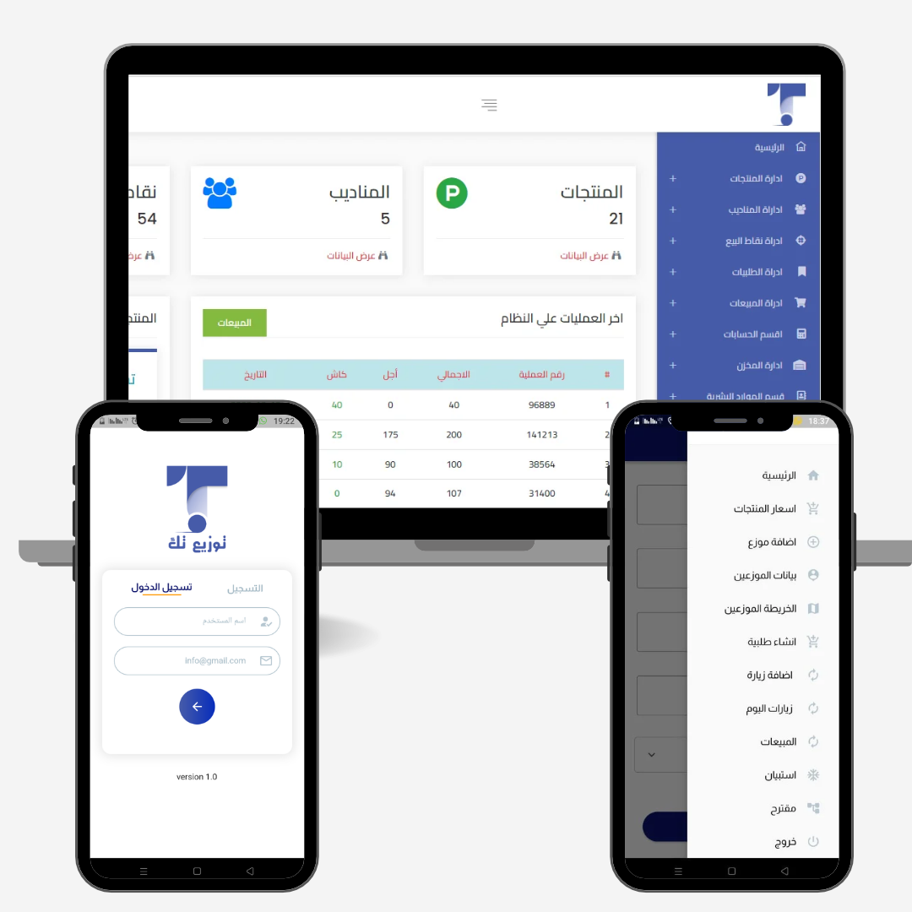
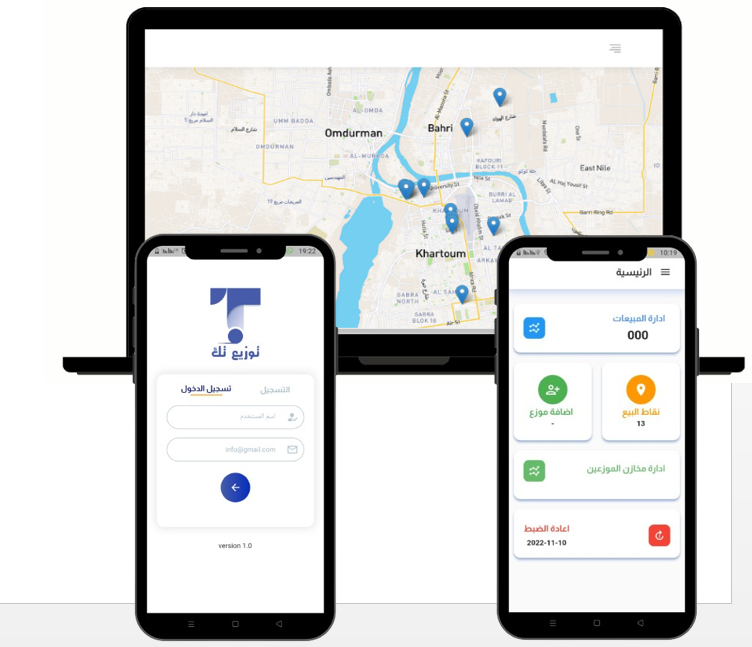
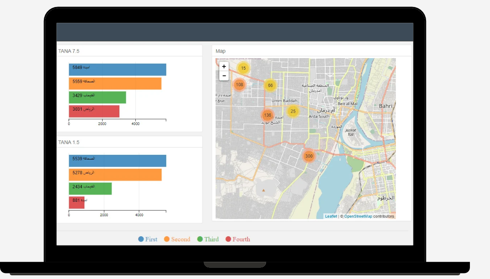

# 🚚 Smart Logistics Services System (Tawzie Tech)

**Tawzie Tech** started as a **Graduation Project in 2022** and successfully transitioned from an academic concept into a real-world solution **applied and utilized in the job market**. 

---

## 📌 About the Project
Traditional product distribution often suffers from inefficient manual routing, lack of real-time monitoring, high operational costs, and poor inventory control. **Tawzie Tech** bridges this gap by offering an integrated solution consisting of:
1. **Web Dashboard (Admin Panel):** For administrators to manage products, monitor active distributors in real-time, view heat/cluster maps of sales, and analyze performance reports.
2. **Mobile Application (Distributor App):** Built with Flutter, enabling field agents to place product orders, add new points of sale, track routes, and record transactions within a precise geographical radius.

---

## 🛠️️ Tech Stack & Tools
* **Front-End & Mobile:** Flutter, Dart, Bootstrap 4, HTML5, CSS3, JavaScript
* **Back-End:** Laravel 8 (PHP MVC Architecture)
* **Database:** MySQL (Normalized relational database schema)
* **Mapping & GIS:** Leaflet.js, Mapbox.js, Google Maps API, ArcGIS

---

## ✨ Key Features
* **Real-Time Tracking & Monitoring:** Live tracking of distribution vehicles and agents on interactive digital maps.
* **Geo-fencing Sales Enforcement:** Sales transactions via the mobile app are restricted to a 200-meter radius from the designated distribution point.
* **Smart Ordering System:** Distributors can request specific product quantities based on real-time inventory availability.
* **Advanced Data Visualization & Reporting:** Generates interactive charts, heat maps, and cluster maps to highlight high-demand regions and top-selling products.
* **Point of Sale (POS) Management:** Dynamic addition, updating, and removal of distribution points directly from the field.

---

## 📱 Application Screenshots & Architecture

### 1. Web Dashboard & Mobile Interfaces

* **Description:** Displays the main administration web dashboard with system statistics (products, distributors, transactions) alongside the Flutter mobile application login and navigation menu screens.

### 2. Live Fleet Tracking & GIS Integration

* **Description:** Illustrates the live interactive map on the web panel tracking distribution fleets across urban regions, paired with the mobile app interface for field management.

### 3. Analytics & Business Intelligence Reporting

* **Description:** Showcases advanced data analytics, regional performance charts, and geographic distribution mapping used for supply chain optimization and sales reporting.

---

## 📂 Project Structure
* `web-backend-laravel/` - Laravel Backend Controllers, Models, and Web Views
* `mobile-app-flutter/` - Flutter Mobile Application Source Code
* `docs/` - Graduation Project Research PDF and Presentation Files
